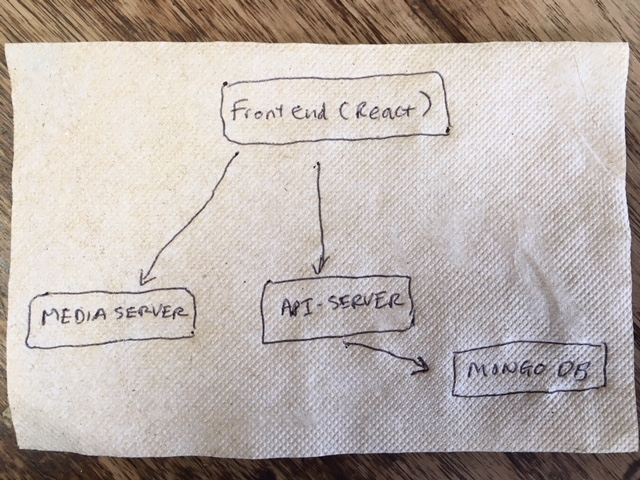
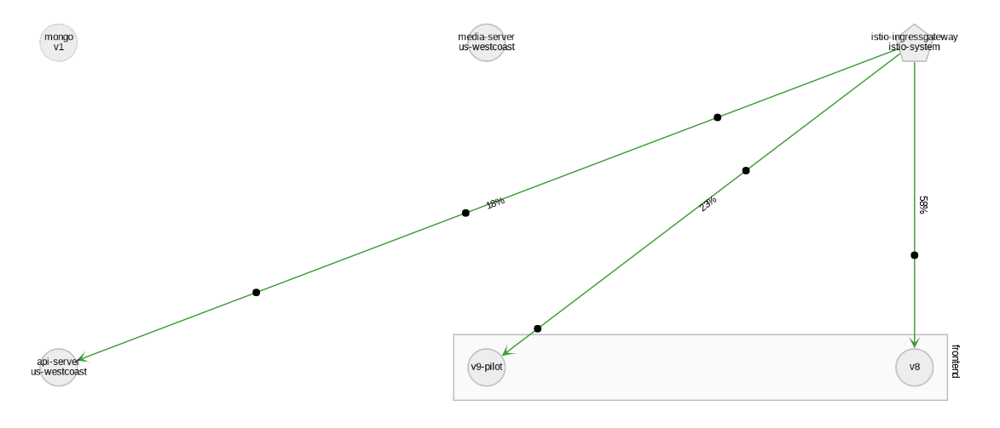

# Pet Photo sharing app
Petsiogram, a fictional pet photo sharing app, demonstrates the use [Istio](https://istio.io/) and [Kiali](https://kiali.org) to manage and visualize your microservices app.



Once the app is deployed you can view its service mesh in Kiali.  The service mesh includes a simple [A-B testing scenario](istio/mesh.yaml#L31) - request for the React frontend app is split between v8 and v9-pilot.


# Openshift 
Prerequisites: OpenShift 3.9, Istio 3.8 and Kiali

## 1. Prepare the app
```
oc new-project pets
# Save project name and cluster domain for later 
export PROJECT=$(oc project -q)
export DOMAIN=<your cluster's public domain or the following if you're running minishift: $(minishift ip).nip.io>
```
Deploy
```
# curl https://raw.githubusercontent.com/vnugent/petsiogram/master/pets-demo-openshift.yaml | oc create -f -
# oc new-app --template pets-demo --param NAMESPACE=$PROJECT --param CLUSTER_DOMAIN=$DOMAIN
```
Verify deployment pods are in Completed state and app pods are in Running state
```
# oc get pods

NAME                    READY     STATUS      RESTARTS   AGE
api-server-1-9gbl7      2/2       Running     0          57s
api-server-1-deploy     1/2       Completed   0          2m
frontend-1-deploy       1/2       Completed   0          2m
frontend-1-lrxx4        2/2       Running     0          57s
media-server-1-deploy   1/2       Completed   0          2m
media-server-1-jw4b2    2/2       Running     0          1m
mongo-1-deploy          1/2       Completed   0          2m
mongo-1-hsssr           2/2       Running     0          1m
```
Verify you can view the app in the browser before moving on to setting up service mesh.  To find out public url for the React app:
```
# oc get route frontend
```
## 2. Create Istio service mesh

We are now ready to setup Istio Ingress gateway to handle incoming traffic.

Delete existing OpenShift test routes
```
# oc delete route api-server frontend
```
In case you want to re-enable them for debugging:
```
# oc expose service api-server -l app=pets
# oc expose service frontend  -l app=pets
```
Setup service mesh.  Note: istioctl command isn't aware of your current OpenShift namespace.  You should always specify `-n <namespace>`
```
# envsubst '${PROJECT} ${DOMAIN}' < istio/mesh.yaml | istioctl -n $PROJECT -f -
```
Expose gateway endpoints as OpenShift routes
Note: `-n istio-system` is needed because the route needs to be in istio-system namespace in order to access ingress gateway service
```
# oc expose service istio-ingressgateway --name pets-frontend --hostname=frontend-${PROJECT}.${DOMAIN} --port=80 -n istio-system
# oc expose service istio-ingressgateway --name pets-apiserver --hostname=api-server-${PROJECT}.${DOMAIN} --port=80 -n istio-system
```


# Kubernetes (TBD)
