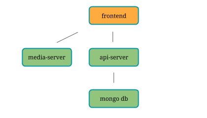

# Pet Photo sharing app
Petsiogram, a fictional pet photo sharing app, demonstrates the use [Istio](https://istio.io/) and [Kiali](https://kiali.org) to manage and visualize your microservices app.


# How to deploy
## 1. On Openshift 
Prerequisites: OpenShift 3.9, Istio 3.8 and Kiali.  Due to a known bug with Istio/Envoy you need to perform additional clean up steps (included in this readme).  See this [blog post](https://developers.redhat.com/blog/2018/04/05/coolstore-microservices-service-mesh-part-1-exploring-auto-injection/) for more information.
Set up a new project
```
# oc new-project pets
# oc adm policy add-scc-to-user privileged -z default,deployer
# oc adm policy add-scc-to-user anyuid -z default,deployer 
# oc label namespace $(oc project -q) istio-injection=enabled
```
Deploy the app
```
# oc create -f pets-demo-openshift.yaml
# oc new-app --template pets-demo --param NAMESPACE=$(oc project -q) --param CLUSTER_DOMAIN=<your cluster's public domain. Example: $(minishift ip).nip.io>
```
Verify deployment pods are in Completed state and app pods are in Running state
```
# oc get pods

NAME                    READY     STATUS      RESTARTS   AGE
api-server-1-9gbl7      2/2       Running     0          57s
api-server-1-deploy     1/2       Completed   0          2m
frontend-1-deploy       1/2       Completed   0          2m
frontend-1-lrxx4        2/2       Running     0          57s
media-server-1-deploy   1/2       Completed   0          2m
media-server-1-jw4b2    2/2       Running     0          1m
mongo-1-deploy          1/2       Completed   0          2m
mongo-1-hsssr           2/2       Running     0          1m
```
If you look at OpenShift console, the deployments are still stuck in In-progress state.  Let's kill all proxy process associated with the deployer pod so that deployment can finish.
```
# oc get pods|grep deplo[y]|awk '{print $1}'|xargs --no-run-if-empty -I {} oc rsh -c istio-proxy {} pkill -f istio
```

## 2. On Kubernetes (TBD)
